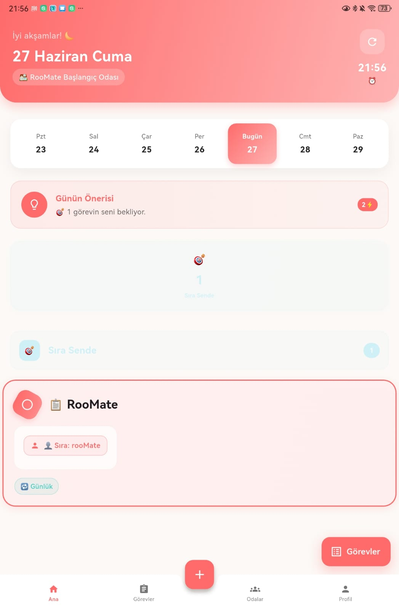
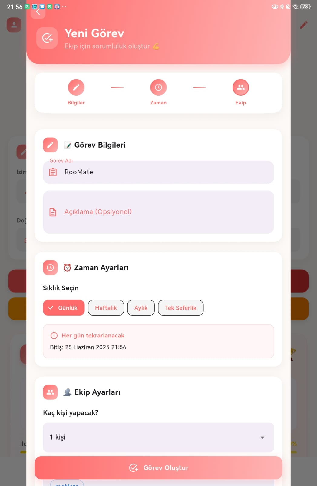
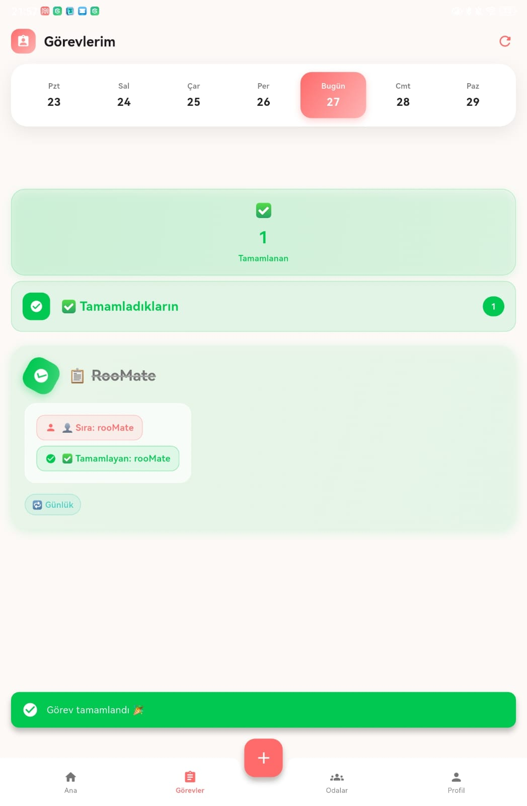
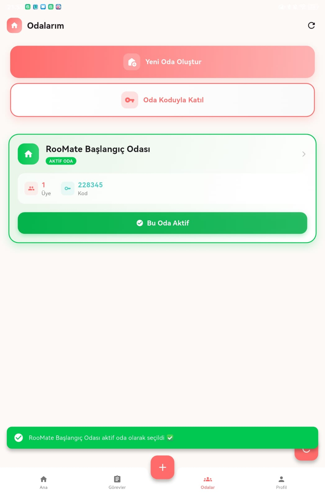

# RooMate 

RooMate, oda arkadaşlarının görevlerini paylaşmasını, sırayla tamamlamasını ve birbirini puanlamasını sağlayan bir **Flutter + Firebase** uygulamasıdır.  

##  Özellikler
-  Görev ekleme, sıklık seçme ve görevlerin sırayla dönmesi  
-  Bildirim senaryoları: yeni görev, tamamlandı, gecikme, puanlama, doğum günü, rozet  
-  Çoklu oda desteği (her kullanıcı aktif odasında görev yönetir)  
-  Profil ekranı: RooScore, Görev Geçmişi, Oda Performansı, Rozetler  
-  Pixel-perfect Figma → Flutter UI

##  Teknolojiler
- Flutter 3.x & Dart  
- Firebase Auth & Firestore  
- Bloc / Cubit (AuthCubit, OdaCubit, GorevCubit)  
- Responsive design (MediaQuery, LayoutBuilder, screenutil)

##  Ekran Görüntüleri

**Giriş Ekranı**  

**Ana Sayfa**  

**Görev Ekleme**  

**Görevlerim**  

**Odalarım**  

- Daha fazla ekran görüntüsü için repodaki diğer görsellere göz atabilirsiniz.

- Bu repo vitrin amaçlıdır. Kodlar private tutulmaktadır. Talep halinde iş görüşmelerinde erişim sağlanabilir.
